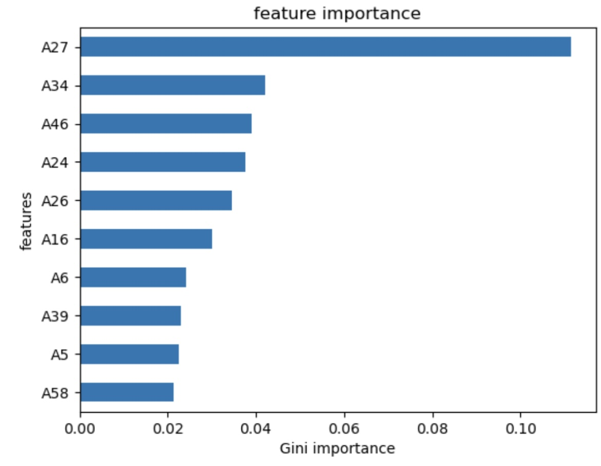

# 🏦 Bankruptcy Prediction Using Financial Ratios

This project focuses on building a machine learning model to predict company bankruptcy using financial statement ratios from the [UCI Machine Learning Repository](https://archive.ics.uci.edu/). The goal is to identify key financial indicators that influence bankruptcy and train a predictive model using decision trees and random forests.

---

## 📊 Project Overview

* **Dataset**: Polish Companies Bankruptcy Data
* **Rows**: 44,405
* **Features**: 66 financial attributes
* **Target Column**: `class` (renamed to `bankrupt` in preprocessing)
* **Goal**: Predict whether a company will go bankrupt based on its financial indicators.

---

## 🧰 Tools & Technologies

* Python
* Pandas, NumPy
* Matplotlib, Seaborn
* Scikit-learn
* Imbalanced-learn (oversampling and undersampling)
* Pickle (model serialization)

---

## 🔍 Project Workflow

### 1. Data Loading

* Fetched from `ucimlrepo`.
* Original target column `class` was renamed to `bankrupt`.

### 2. Exploratory Data Analysis (EDA)

* Class imbalance visualized.
* Outlier treatment using 10th–90th percentile range for select features (e.g., `A27`, `A26`).
* Boxplots and correlation heatmaps to assess feature relationships with bankruptcy.
* Top financial predictors were identified visually.

### 3. Feature Engineering

* Missing values handled using `SimpleImputer` with `'median'` and `'mean'` strategies.
* No scaling (standardization) or SMOTE was applied.
* No dimensionality reduction was done to retain model interpretability.

### 4. Model Building

Three versions of Decision Tree Classifiers were trained:

* **Original Dataset**
* **Oversampled Dataset**
* **Undersampled Dataset**

Each pipeline used:

* `SimpleImputer`
* `DecisionTreeClassifier`

A `RandomForestClassifier` was also trained and tuned using `GridSearchCV`.

### 5. Resampling Techniques

* Oversampling using `RandomOverSampler`
* Undersampling using `RandomUnderSampler`

---

## 📈 Model Performance

| Model Type         | Train Accuracy | Test Accuracy | Notes                                  |
| ------------------ | -------------- | ------------- | -------------------------------------- |
| Baseline Model     | 0.9525         | -             | Proportion of majority class           |
| Original Dataset   | 1.0000         | 0.9506        | High training accuracy                 |
| Oversampled        | 1.0000         | 0.9523        | Better generalization                  |
| Undersampled       | 0.8074         | 0.7842        | Performance drop due to data reduction |
| Final RandomForest | 1.0000         | 0.9666        | Tuned model with best accuracy         |

---

## 🔍 Key Predictors

Features like:

* `A27` (Profit on operating activities / financial expenses)
* `A26` (Retained earnings / total assets)
* `A7` (Current assets / short-term liabilities)
  showed strong correlation with bankruptcy status.

Feature importance plots were generated based on Gini Importance from the final models.

---

## 💾 Model Saving & Prediction

The final model was saved using `pickle`. A helper function `make_prediction()` was included to make predictions on new data using the saved model.

```python
with open('model-5-3.pkl', 'wb') as f:
    pickle.dump(model, f)
```

```python
def make_prediction(datafile, model_file):
    X_test = pd.read_csv(datafile)
    with open(model_file , 'rb') as f:
        model = pickle.load(f)
    return model.predict(X_test)
```

---

## 🖼️ Feature Importance




---

Everything mentioned above — including model building, EDA, training, and evaluation — is implemented directly in the code.
📁 All plots, models, and logic are within the `.ipynb` notebook or scripts provided in the repo.

---

